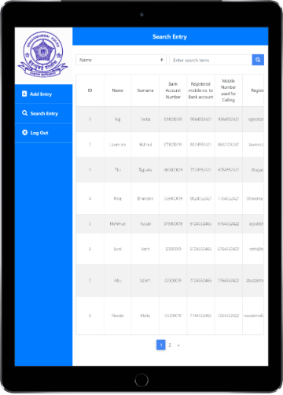
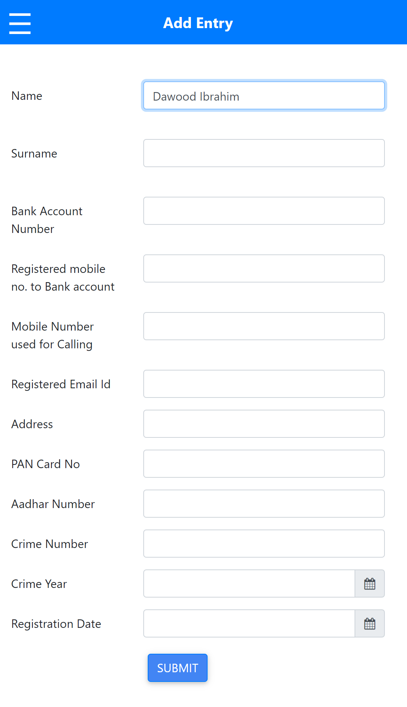
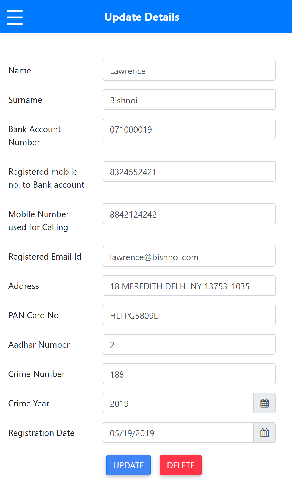

# CrimeLogs

A Simple WebApp to maintain database of alleged Criminals

   

## How to Run

- Place the `crimelogs` folder inside the root server directory
- Create database `crimelogs` from `crimelogs.sql` file
- You are good to go

## Screens

   

## About

Nothing special
